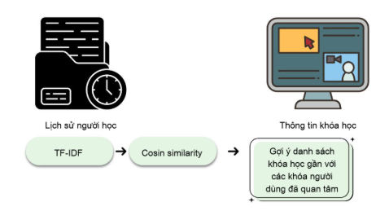

# 📚 NovaLearn Course Recommender

The **NovaLearn Course Recommender** is an algorithm-based, modular service that suggests personalized course recommendations to users based on their learning behavior, preferences, and historical activity. It is part of the broader [NovaLearn](https://github.com/KhoiMaiDinh/ELearning_BE) ecosystem, an e-learning platform.

<p align="center">
  
</p>

## 🔍 Features

-   🎯 **Personalized course recommendations**
-   🧠 **Content-based filtering** using course metadata (title, tags, description)
-   📊 **Flask API** endpoints for external communication with the NovaLearn web app

## 🛠️ Tech Stack

-   **Python 3.10+**
-   **Flask** — Web framework
-   **scikit-learn** — Machine learning utilities (TF-IDF, vectorization)
-   **SQLAlchemy** — ORM for PostgreSQL
-   **pandas**, **numpy**, **scipy** — Data handling and math

## 🧠 Recommendation Logic

### ✅ Content-Based Filtering

Implemented in [`app/recommender/services.py`](app/recommender/services.py):

-   TF-IDF vectorization on course descriptions
-   Cosine similarity between user interests and course vectors
-   Tag and category matching
-   Custom scoring based on rating, popularity, and recentness

## 📦 Installation

```bash
# Create virtual environment
python -m venv venv
source venv/bin/activate  # On macOS/Linux
venv\Scripts\activate     # On Windows

# Install dependencies
pip install -r requirements.txt
```

## ⚙️ Configuration

Create a .env file based on .env.example:

```bash
cp .env.example .env
# Then edit .env with your DB credentials and config
```

## 🏁 Running the Service

```bash
# Ensure database is properly set up from NovaLearn main service first
# Then start the Flask server
flask run
```

## 🚀 Future Improvements

🔄 Add collaborative filtering (user-user and item-item)

---

> 💡 This is a submodule of the NovaLearn system. For full platform capabilities, see the main NovaLearn repo or contact [me](https://github.com/KhoiMaiDinh) for further help.
